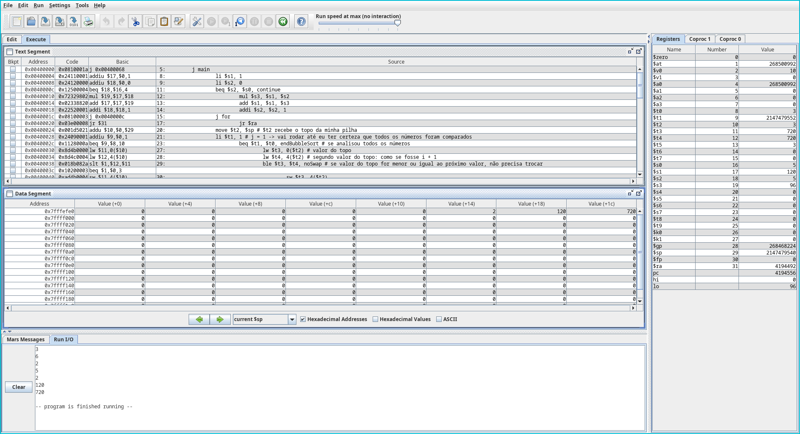
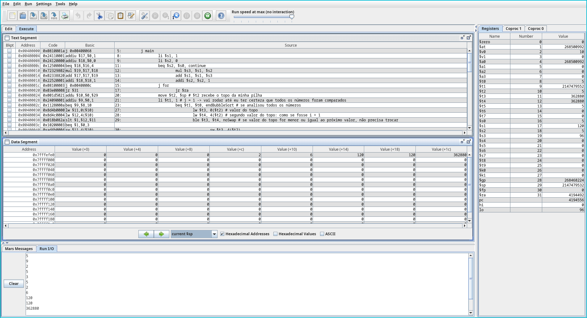

# ❗Factorial and Sort

This project was created for a college project. 

In this project you enter the number of numbers you want to see in the factorial, enter the numbers you want and then the program sorts using Bubble Sort.

To order it, we used the stack.

## ⚙️ See it running

## 👨‍💻 How to install and run

We used Mars to do this, so try it and download [here](https://courses.missouristate.edu/KenVollmar/MARS/).

After that, just upload the `.asm` project and run it.

## 👥 Colaborators
I didn't make this all by myself.

Thank you [Lucas Polidorio](https://github.com/luskaQ) and [Giulia Mezaroba](https://github.com/Giulia1955).
    
## 📝 License

This project has the [MIT](https://choosealicense.com/licenses/mit/) license.

